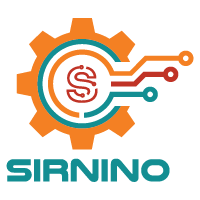

#  &nbsp; &nbsp; &nbsp; Human being from 1987, developer from 2005

&nbsp;&nbsp;&nbsp;&nbsp;

Hi there 👋

I'm **Sirnino**, software engineer and architect for passion and profession. Curious internet surfer and world observer.

Find out more about me on my blog [https://sirnino.github.io](https://sirnino.github.io).

<h2>My Stats</h2>

<h2>🚀 I know about...</h2>

<h2> 📝Latest blog posts </h2>

<ul>
 <li> <h3><a href="https://sirnino.github.io/posts/how-to-write-a-good-commit-message/">How to write a good commit message</a></h3></li>
 <li><h3><a href="https://sirnino.github.io/posts/how-i-am-leveraging-my-it-skills-against-covid-19-pandemic/">How I am leveraging my IT skills against Covid-19 pandemic</a></h3></li>
 <li><h3><a href="https://sirnino.github.io/posts/top-5-design-pattern-every-programmer-should-know-and-use/">Top 5 design pattern every Programmer should know (and use)</a></h3></li>
 </ul>